# Дипломный проект: Облачная инфраструктура и Kubernetes (K3s)

## Описание
В рамках дипломного проекта была спроектирована и развернута отказоустойчивая облачная инфраструктура в Yandex Cloud с использованием Terraform, Ansible и Kubernetes (K3s). Реализована система мониторинга на базе Prometheus/Grafana и настроен CI/CD пайплайн.

## Архитектура решения
- **IaC:** Terraform (S3 backend, модульная структура)
- **Orchestration:** K3s (1 Master + 2 Preemptible Workers)
- **Config Management:** Ansible (автоматическая установка кластера)
- **Monitoring:** kube-prometheus-stack (Helm)
- **CI/CD:** GitHub Actions (автоматический деплой манифестов)

## Скриншоты выполнения этапов

### 1. Инфраструктура (Terraform)
| Этап | Скриншот |
|------|----------|
| Bootstrap SA & S3 Bucket | 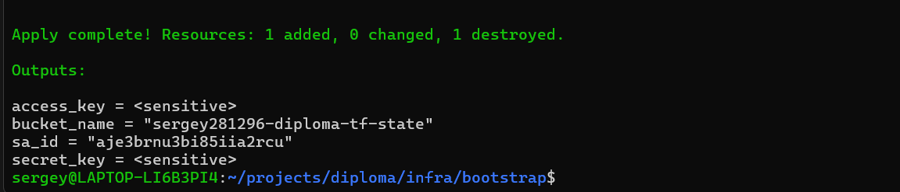 |
| Создание ВМ и сети | 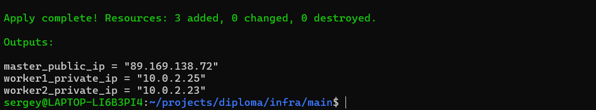 |
| Публичные IP воркеров | 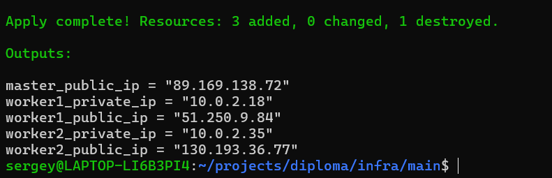 |

### 2. Kubernetes Cluster (Ansible + K3s)
| Этап | Скриншот |
|------|----------|
| Установка K3s через Ansible | 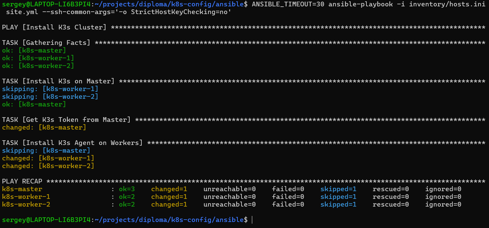 |
| Статус нод (Ready) | 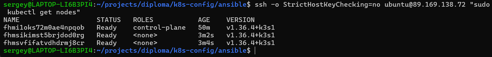 |

### 3. Приложение и Мониторинг
| Этап | Скриншот |
|------|----------|
| Сборка Docker образа | 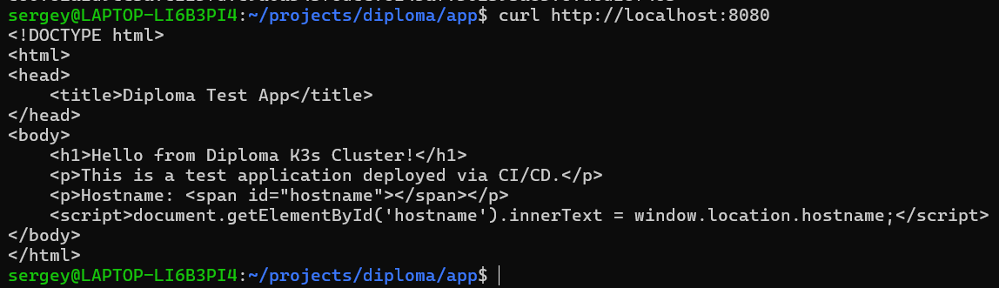 |
| Установка Helm чарта | 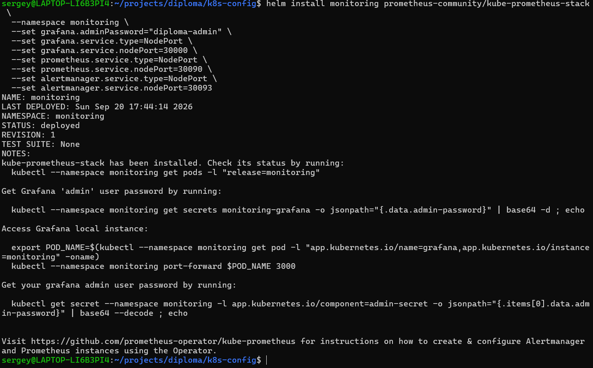 |
| Статус всех подов | 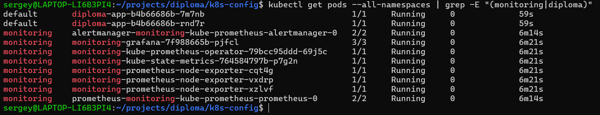 |
| Дашборд Grafana | 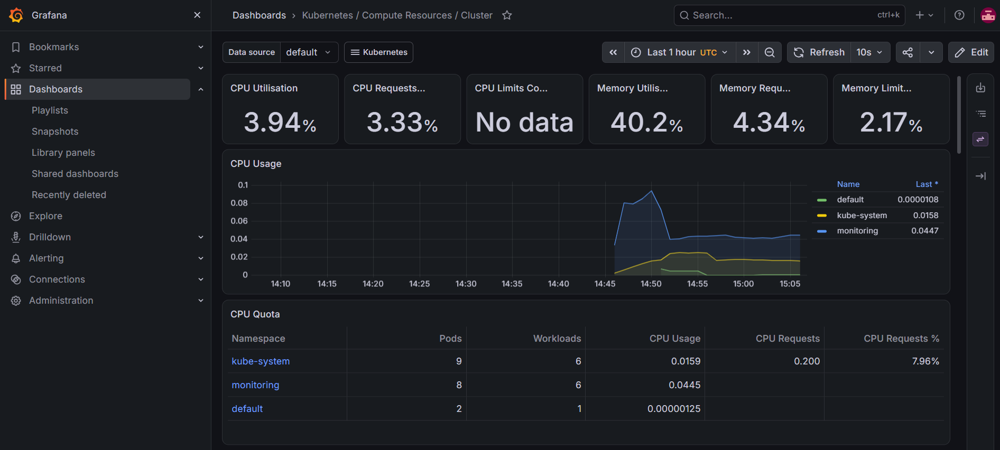 |
| Веб-интерфейс приложения | 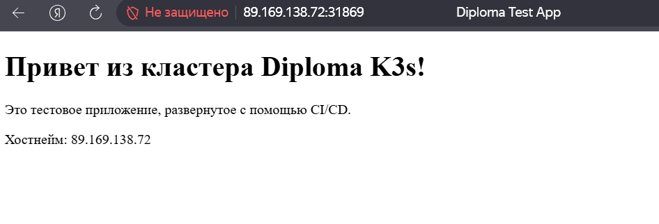 |

### 4. Автоматизация (CI/CD)
| Этап | Скриншот |
|------|----------|
| GitHub Actions Workflow | 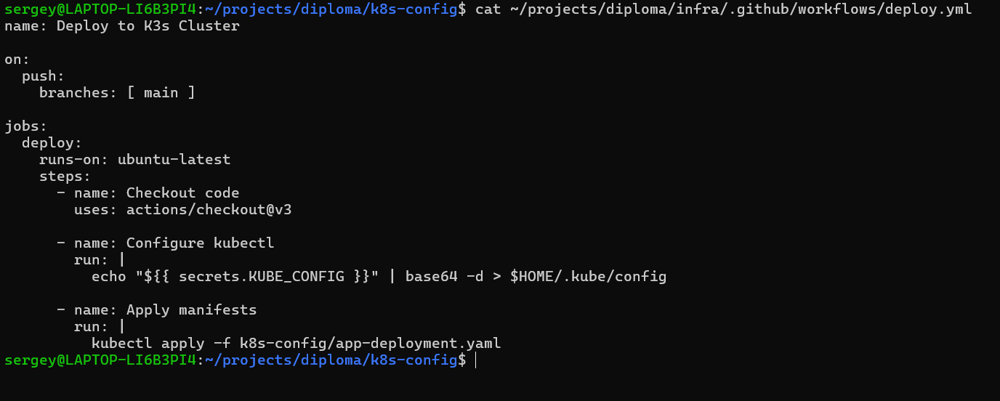 |

## Ссылки на связанные репозитории
- 🏗️ [diploma-infra](https://github.com/sergey-281296/diploma-infra) — Terraform код инфраструктуры
- ️ [diploma-k8s-config](https://github.com/sergey-281296/diploma-k8s-config) — Ansible playbooks и Helm values
-  [diploma-app](https://github.com/sergey-281296/diploma-app) — Dockerfile и исходный код приложения
